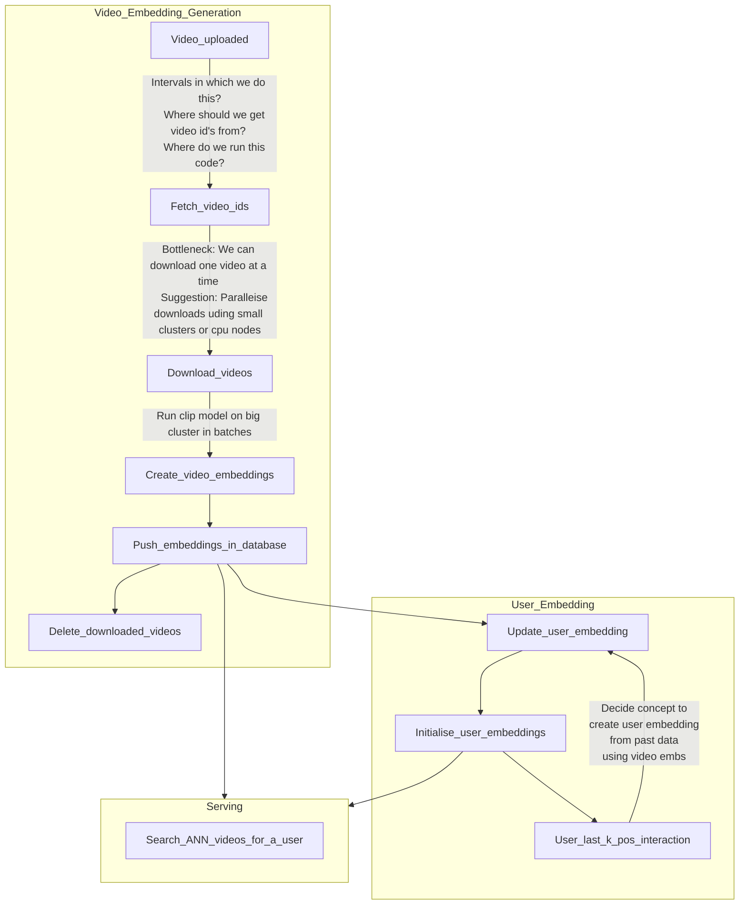

```mermaid
flowchart TB
    subgraph Video_Embedding_Generation 
    direction TB
    Video_uploaded-- Intervals in which we do this?
    Where should we get video id's from? 
    Where do we run this code? -->Fetch_video_ids
    Fetch_video_ids -- Bottleneck: We can download one video at a time 
    Suggestion: Paralleise downloads uding small clusters or cpu nodes--> Download_videos
    Download_videos-- Run clip model on big cluster in batches 
    --> Create_video_embeddings
    Create_video_embeddings --> Push_embeddings_in_database
    Push_embeddings_in_database --> Delete_downloaded_videos
    end

    subgraph User_Embedding
    direction TB
    Initialise_user_embeddings --> User_last_k_pos_interaction
    User_last_k_pos_interaction-- Decide concept to 
    create user embedding 
    from past data 
    using video embs--> Update_user_embedding
    Update_user_embedding
     --> Initialise_user_embeddings
    end
    direction TB
    Push_embeddings_in_database --> Update_user_embedding

    subgraph Serving
    Search_ANN_videos_for_a_user
    end

    Initialise_user_embeddings --> Serving
    Push_embeddings_in_database --> Serving
```